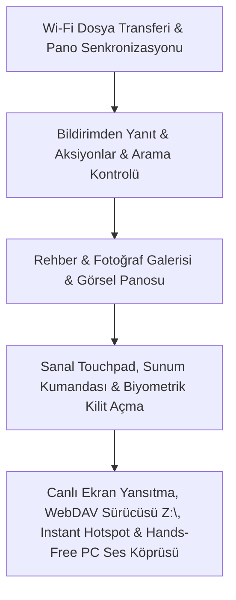

# Özellik Karşılaştırma Matrisi ve Yol Haritası (Roadmap)

Bu belge; **Android-Sync**, **Microsoft Telefon Bağlantısı (Phone Link)** ve **KDE Connect** sistemleri arasındaki özellik farklarını, eksik yetenekleri ve projemizin benzersiz üstünlüklerini kapsamlı bir şekilde listeler.

---

## 📊 Genel Karşılaştırma Özeti

| Özellik Grubu | Yetenek / Modül | Android-Sync (Bizim) | Microsoft Telefon Bağlantısı | KDE Connect |
| :--- | :--- | :---: | :---: | :---: |
| **İşletim Sistemi Desteği** | Windows Desteği | ✅ Tam | ✅ Tam | ✅ Kısmi / Topluluk |
| | macOS Desteği | ✅ Tam (Yerel Swift & Go) | ❌ Yok | ⚠️ Kısıtlı / Kararsız |
| | Çoklu Cihaz / Mesh (Win + Mac + Tel aynı anda) | ✅ **Var (Özgün)** | ❌ Yok (Yalnızca 1-1) | ⚠️ Kısmi |
| **Bildirimler** | Telefondan PC/Mac'e Bildirim Akışı | ✅ Tam | ✅ Tam | ✅ Tam |
| | PC/Mac Bildirimlerinin Telefona Akışı | ✅ **Var (Çift Yönlü)** | ❌ Yok (Yalnızca Tel -> PC) | ❌ Yok |
| | Bildirime PC'den Doğrudan Yanıt Verme (Inline Reply) | ✅ **Var (Tamamlandı)** | ✅ Var | ✅ Var |
| | Bildirim Aksiyon Butonları (Arşivle, Onayla vb.) | ✅ **Var (Tamamlandı)** | ✅ Var | ✅ Var |
| | Çift Yönlü Bildirim Kapatma (Dismiss Sync) | ✅ **Var (Tamamlandı - Çift Yönlü)** | ✅ Var | ✅ Var |
| **Medya & Ses** | Çift Yönlü Bağımsız Medya Takibi & Kontrolü | ✅ **Var (Özgün)** | ❌ Kısıtlı | ❌ Tekil |
| | Medya Süresi İlerleme Çubuğu (Seek Bar & ±15s) | ✅ Var | ❌ Yok | ⚠️ Kısmi |
| | Arama Sırasında PC Medyasını Otomatik Duraklatma | ✅ Var | ❌ Yok | ✅ Var |
| | PC Ses Düzeyi Yönetimi | ✅ Var | ❌ Yok | ✅ Var |
| **Arama & SMS** | Gelen Arama Uyarısı & Bildirimi | ✅ Var | ✅ Var | ✅ Var |
| | PC Üzerinden Sesli Telefon Görüşmesi (Hands-Free PCM Audio) | ✅ **Var (Tamamlandı)** | ✅ Var | ❌ Yok |
| | Arama Başlatma (DIAL) / Reddetme / Sessize Alma | ✅ Var | ✅ Var | ⚠️ Kısmi |
| | SMS Geçmişi Görüntüleme & PC'den SMS Gönderme | ✅ Var | ✅ Var | ✅ Var |
| | Telefon Rehberi (Contacts) Entegrasyonu | ✅ **Var (Tamamlandı)** | ✅ Var | ❌ Yok |
| **Dosya & Depolama** | Hızlı Kablosuz Dosya Transferi (Share to Device) | ✅ **Var (Tamamlandı - Çift Yönlü)** | ⚠️ Sadece Samsung/Honor | ✅ Tam |
| | Telefon Dosya Sistemini Ağ Sürücüsü Olarak Bağlama (WebDAV - Z:\) | ✅ **Var (Tamamlandı - Z:\)** | ❌ Yok | ✅ Var |
| | Fotoğraf Galerisi Gezgini (Photos Explorer & Lightbox) | ✅ **Var (Tamamlandı)** | ✅ Var | ❌ Yok |
| **Ekran & Uygulama** | Telefon Ekranını Yansıtma & Uzaktan Dokunma (Screen Mirroring & Touch) | ✅ **Var (Tamamlandı)** | ✅ Var | ❌ Yok |
| | Android Uygulamalarını Bağımsız Pencerede Açma | ⚠️ Gelecek Planı | ✅ Var | ❌ Yok |
| **Giriş & Kumanda** | Sanal Dokunmatik Yüzey (Touchpad / Fare) | ✅ **Var (Tamamlandı)** | ❌ Yok | ✅ Var |
| | Sanal Klavye (Telefondan PC'ye Tuş Gönderimi) | ✅ **Var (Tamamlandı - Hotkeys)** | ❌ Yok | ✅ Var |
| | Sunum Kumandası (Slayt Değiştirici & Pointer) | ✅ **Var (Tamamlandı - F5/Esc/Slayt)** | ❌ Yok | ✅ Var |
| | Uzaktan Özel Komut Çalıştırma (Lock, Sleep, Shutdown) | ✅ **Var (Tamamlandı)** | ❌ Yok | ✅ Var |
| | Biyometrik Kilit Açma (Parmak iziyle PC/Mac kilidi) | ✅ **Var (Tamamlandı)** | ❌ Yok | ⚠️ Kısmi |
| **Pano & Sistem** | Ortak Pano (Düz Metin) | ✅ Var | ✅ Var | ✅ Var |
| | Ortak Pano (Görsel ve Zengin İçerik) | ✅ **Var (Tamamlandı)** | ✅ Var | ✅ Var |
| | Telefonu Bul (Uzaktan Çaldır & Sustur) | ✅ Var | ❌ Yok | ✅ Var |
| | Anlık Kişisel Erişim Noktası (Instant Hotspot) | ✅ **Var (Tamamlandı)** | ✅ Var | ❌ Yok |
| | Sekme / URL Paylaşımı (Send Tab to Device) | ✅ **Var (Tamamlandı - Çift Yönlü)** | ❌ Yok | ✅ Var |

---

## 🔍 Bizde Olmayan Özelliklerin Detaylı Analizi

### 1. Dosya Paylaşımı ve Depolama Yönetimi
1. **Kablosuz Dosya Gönderme (Wi-Fi File Sharing):**
   - **KDE Connect Yaklaşımı:** Android'de herhangi bir dosya seçilip "Paylaş -> Bilgisayara Gönder" dendiğinde dosya yerel Wi-Fi üzerinden saniyeler içinde PC'deki `İndirilenler` klasörüne aktarılır. Aynı şekilde PC'de sağ tıklanıp "Telefona Gönder" yapılabilir.
2. **SFTP / Dosya Sistemi Bağlama (Mount Remote Filesystem):**
   - **KDE Connect Yaklaşımı:** Telefonun depolama dizini Windows Dosya Gezgini'ne veya macOS Finder'a bir ağ sürücüsü olarak (`Z:\` veya Network Share) bağlanır; telefondaki klasörler arasında doğrudan masaüstünden gezinilir.
3. **Fotoğraf Galerisi Entegrasyonu (Photos Access):**
   - **Phone Link Yaklaşımı:** Telefondaki son fotoğraflar ve ekran görüntüleri PC arayüzünde galeri şeklinde listelenir; masaüstüne sürükle-bırak yapılarak doğrudan kopyalanabilir.

---

### 2. Gelişmiş Bildirim Etkileşimi
1. **Bildirime Doğrudan Yanıt Verme (Inline Reply):**
   - PC'ye gelen bildirim altında bir metin girişi kutusu yer alır. Kullanıcı WhatsApp, Telegram veya SMS bildirimi geldiğinde doğrudan PC klavyesiyle yazıp "Gönder" diyerek telefona dokunmadan yanıt verir.
2. **Bildirim Aksiyon Butonları (Notification Actions):**
   - Telefonda bildirimle gelen özel eylemler PC'de buton olarak gösterilir (Örn: Banka uygulamasının *"Girişi Onayla / Reddet"* butonları, e-postada *"Arşivle"* butonu, müzikte *"Beğen"* butonu).
3. **Çift Yönlü Bildirim Kapatma (Dismiss Sync):**
   - PC'de bir bildirim kapatıldığında (veya temizlendiğinde), Android telefonun durum çubuğundaki bildirim de otomatik kaldırılır; tersi durumda telefondan silinen bildirim PC ekranından kaybolur.

---

### 3. PC Üzerinden Sesli Telefon Görüşmesi (Hands-Free Audio Calling)
- **Phone Link Yaklaşımı:**
  - Bilgisayar ile telefon arasında Bluetooth HFP (Hands-Free Profile) üzerinden gerçek zamanlı ses köprüsü kurulur.
  - Çağrı kabul edildiğinde ses ve mikrofon doğrudan bilgisayarın kulaklığına veya hoparlörüne aktarılır; telefon cepten çıkarılmadan görüşme tamamlanır.
  - *(Bizim mevcut durumumuz: Arama algılama, reddetme, sessize alma ve numara çevirerek arama başlatma var; fakat görüşme sesi telefonda kalır).*

---

### 4. Ekran Yansıtma ve Uygulama Akışı
1. **Telefon Ekranını PC'de Görüntüleme & Kontrol (Phone Screen Mirroring):**
   - Scrcpy veya WebRTC tabanlı H.264/H.265 video akışı ile telefon ekranı bir pencere olarak PC'ye aktarılır; fare tıklamaları dokunmaya, klavye girdileri telefon girişine dönüştürülür.
2. **Bağımsız Uygulama Pencereleri (App Streaming):**
   - Telefondaki belirli bir uygulama başlatılarak masaüstünde müstakil bir pencere içinde çalıştırılır.

---

### 5. Uzaktan Kumanda ve Giriş Cihazı Yetenekleri
1. **Sanal Dokunmatik Yüzey (Virtual Touchpad):**
   - Telefon ekranı bir laptop touchpad'i gibi çalışır; tek parmak fare hareketi, tek dokunuş sol tık, çift parmak sağ tık, iki parmakla sayfa kaydırma (scroll) sağlar.
2. **Sunum Kumandası (Presentation Remote):**
   - PowerPoint / Keynote / PDF sunumları sırasında slaytları ileri/geri alma ve ekran üzerinde sanal lazer işaretçi kontrolü.
3. **Özel Komut Çalıştırma (Run Commands):**
   - PC'de önceden yapılandırılan scriptler telefondan tek dokunuşla çalıştırılır:
     - *"Bilgisayarı Kapat"* (`shutdown /s /t 0`)
     - *"Yeniden Başlat"* (`shutdown /r /t 0`)
     - *"Ekranı Kilitle"* (`rundll32.exe user32.dll,LockWorkStation`)
     - *"Uyku Moduna Al"*
4. **Biyometrik Kilit Açma:**
   - Telefonda parmak izi okutularak Windows veya macOS kilit ekranının otomatik açılması.

---

### 6. Sistem & Ağ Entegrasyonları
1. **Görsel Panosu (Image Clipboard Sync):** *(✅ Tamamlandı)*
   - PC veya Mac'te `Win + Shift + S` / `Cmd + C` ile kopyalanan veya telefonda ekran görüntüsü alınan resimler doğrudan `PNG/Bitmap` formatında cihazlar arasında çift yönlü senkronize edilir. Web panellerinde anlık görsel önizlemesi ve indirme butonu yer alır.
2. **Sekme / Web Sayfası Paylaşımı (Send Tab to Device):** *(✅ Tamamlandı)*
   - Telefondan veya PC/Mac tarayıcısından tek tıkla açık olan URL diğer cihazın varsayılan tarayıcısında anında açılır. Android paylaşım menüsü ve PC/Mac web panelleri entegredir.
3. **Telefon Rehberi (Contacts) Entegrasyonu:** *(✅ Tamamlandı)*
   - Telefon rehberindeki kişiler PC ve Mac paneline taranarak alfabetik listelenir, anlık isim/numara araması, tek tıkla doğrudan arama (`DIAL`) ve hızlı SMS başlatma sunulur.
4. **Fotoğraf Galerisi Önizleyicisi (Photos Gallery & Lightbox):** *(✅ Tamamlandı)*
   - Telefondaki kamera fotoğrafları ve ekran görüntüleri optimize thumbnail ve yüksek çözünürlüklü Lightbox modal ile PC/Mac web panelinde gezilebilir, tek tıkla indirilebilir.
5. **Anlık Kişisel Erişim Noktası (Instant Hotspot):**
   - Telefonda hotspot açma ayarlarıyla uğraşmadan, PC üzerinden tek tıkla hücresel internet paylaşımını tetikleme ve bağlanma.

---

## 💎 Bizim Projemizin Rakiplerine Göre Benzersiz Avantajları

1. **Çoklu Cihaz ve Mesh Mimarisi (Windows + Mac + Android Birlikte):**
   - **Phone Link:** Sadece 1 Windows PC ve 1 Android telefon arasında çalışır; macOS desteği hiç yoktur.
   - **Android-Sync:** Aynı anda 1 Android telefon, 1 Windows masaüstü ve 1 MacBook'u tek bir ağda birbirine bağlar; pano (metin + görsel), rehber, galeri, sekmeler ve bildirimler tüm cihazlar arasında çapraz senkronize edilir.
2. **Çift Yönlü Bildirim Akışı (PC/Mac -> Telefon):**
   - Phone Link ve KDE Connect yalnızca telefondaki bildirimi PC'ye taşır.
   - Projemiz, **Windows ve macOS'ta oluşan bildirimleri de yakalayarak gerçek zamanlı olarak telefona aktarır**.
3. **Bağımsız Çift Medya Takip Motoru:**
   - Aynı anda hem bilgisayarda çalan medyayı (Spotify, YouTube vb.) hem de telefonda çalan müziği ayrı kartlarda takip edip, her ikisini de ±15 saniye atlatma ve yüzde bazlı Seek Bar ile yönetebilme yeteneği rakiplerinde bulunmaz.
4. **Hafif ve Bağımsız Mimari (Go + Vanilla Web + Kotlin):**
   - Microsoft Store / UWP bağımlılığı veya ağır arka plan servisleri gerektirmez; tek bir hafif ikili dosya (`windows-sync.exe` / `mac-sync`) ile taşınabilir (portable) olarak çalışır.

---

## 🚀 Geliştirme Yol Haritası ve Tamamlanan Modüller

### Tamamlanan Yetenekler & Modüller:
- **Canlı Ekran Yansıtma & Uzaktan Dokunma (Screen Mirroring & Remote Touch):** *(✅ Tamamlandı)* Android `MediaProjection` tabanlı canlı ekran yakalama, MJPEG ve WebSocket akışı; web panelinden interaktif fare tıklamaları ve dokunma hareketleri ile telefon kontrolü ve sanal gezinme tuşları (Geri, Ana Ekran, Son Uygulamalar).
- **Telefon Dosya Sistemini Ağ Sürücüsü Olarak Bağlama (WebDAV - Z:\):** *(✅ Tamamlandı)* Telefonda çalışan yerleşik WebDAV sunucusu (`port 8088`) ile Windows Gezgini'ne doğrudan `Z:\` sürücüsü olarak bağlanma, doğrudan dosya okuma, yazma ve gezinme.
- **Anlık Kişisel Erişim Noktası (Instant Hotspot):** *(✅ Tamamlandı)* Telefonda hotspot menüleriyle uğraşmadan tek tıkla hücresel internet paylaşımı başlatma ve PC'nin otomatik Wi-Fi profili oluşturup bağlanması.
- **PC Üzerinden Sesli Telefon Görüşmesi (Hands-Free PCM Audio Bridge):** *(✅ Tamamlandı)* Görüşme sırasında telefon mikrofonunun 16kHz PCM olarak PC hoparlörüne aktarılması ve PC mikrofonunun telefona çift yönlü iletilmesiyle eller serbest çağrı deneyimi.
- **Sanal Touchpad & Fare / Medya Kumandası:** *(✅ Tamamlandı)* Telefon ekranını hassas dokunmatik laptop trackpad'i veya slayt / sunum uzaktan kumandası olarak gecikmesiz kullanabilme.
- **Biyometrik Kilit Açma (Biometric Unlock):** *(✅ Tamamlandı)* Android `BiometricPrompt` ile telefonun parmak izi veya yüz tanımasıyla Windows veya Mac kilidinin anında açılması.
- **Görsel Panosu & Sekme Paylaşımı & Fotoğraf Galerisi & Rehber Entegrasyonu:** *(✅ Tamamlandı)* Çift yönlü görsel kopyalama, anlık sekme aktarımı, fotoğraf önizleme/indirme ve rehber senkronizasyonu.

